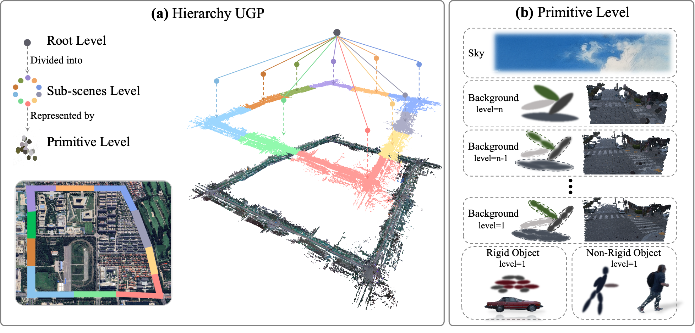

# Hierarchy UGP: Hierarchy Unified Gaussian Primitive for Large-Scale Dynamic Scene Reconstruction


### Pipeline



### Citation

If you find this code useful for your research, please use the following BibTeX entry.

```
@article{shyyql2024HierarchyUGP,
  title={Hierarchy UGP: Hierarchy Unified Gaussian Primitive for Large-Scale Dynamic Scene Reconstruction},
  author={Sun Hongyang and Yang Qinglin and Wang Jiawei and Xu Zhen and Liu Chen and Wang Yida and Zhan Kun and Bao Hujun and Peng Sida and Zhou Xiaowei},
  year={2024},
}

```
